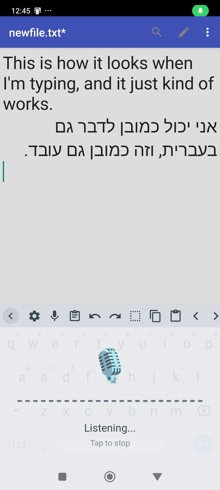
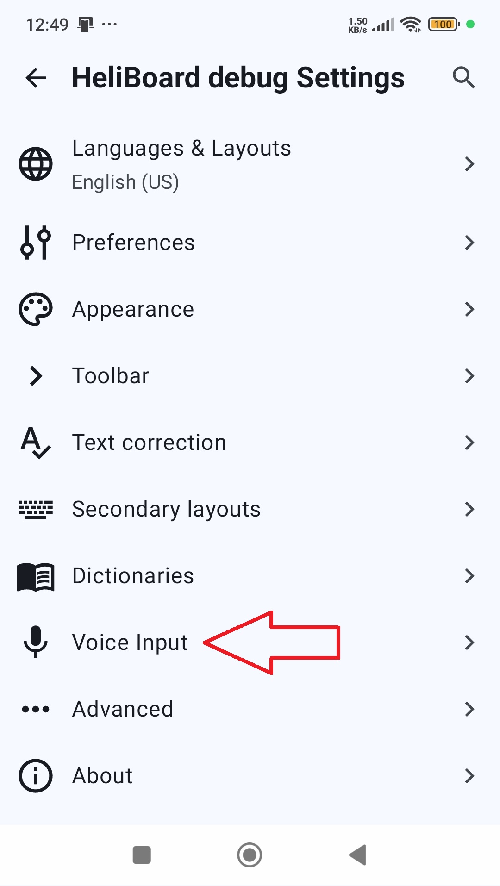
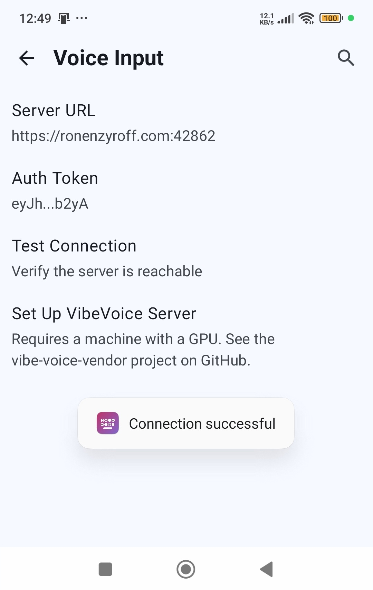

# HeliBoard + VibeVoice ASR

> **Disclaimer:** This project is not affiliated with, endorsed by, or sponsored by Microsoft Corporation. VibeVoice is a Microsoft product; this project merely integrates with it as an end user.

> **Note:** This is a fork of [HeliBoard](https://github.com/Helium314/HeliBoard). See the [original HeliBoard README](README-orig.md) for upstream documentation.

---

Voice typing on Android is terrible. It's nowhere near state-of-the-art, and typing on a phone all day genuinely hurts — thumbs, wrists, everything. It shouldn't have to be this way.

This project replaces HeliBoard's voice input with [VibeVoice](https://huggingface.co/microsoft/VibeVoice), Microsoft's state-of-the-art ASR model. You speak, it transcribes — in any language, with real accuracy.

## How it works

The voice typing is powered by [vibe-voice-vendor](https://github.com/NatanFreeman/vibe-voice-vendor), a self-hosted VibeVoice server by [@NatanFreeman](https://github.com/NatanFreeman). The keyboard records audio on your phone, sends it to your server, and streams back the transcription.

1. Tap the mic icon in the keyboard toolbar
2. Speak — audio is captured as 16 kHz mono WAV
3. Tap anywhere to stop recording
4. The audio is uploaded to your VibeVoice server over HTTPS with Bearer token auth
5. The server streams back the transcription via SSE
6. The transcribed text is inserted into whatever text field you're typing in

## The catch

You need to run your own [vibe-voice-vendor](https://github.com/NatanFreeman/vibe-voice-vendor) server on a machine with a decent GPU (tested on RTX 5090). The server runs the VibeVoice model via vLLM and exposes a simple HTTP API.

Once your server is up, configure it in the app:

Enter your server URL and auth token in **Settings > Voice Input**, then tap **Test Connection** to verify:

## Installing

Download the latest APK from the [Releases](https://github.com/BigBIueWhale/heliboard-microsoft-vibevoice-asr/releases) page, then:

1. Transfer the APK to your phone and install it (enable "Install from unknown sources" if prompted)
2. Go to **Settings > System > Languages & input > On-screen keyboard** and enable **HeliBoard VibeVoice Debug**
3. Open any text field, switch to HeliBoard VibeVoice via the keyboard icon in the nav bar
4. Open **HeliBoard VibeVoice Settings > Voice Input** and enter your server URL and auth token
5. Tap the mic icon in the toolbar — grant the microphone permission on first use

> **Note:** The APK is a debug build (signed with a debug key, app ID `helium314.keyboard.vibevoice.debug`). Minification is enabled so the APK size stays small. There is no release signing keystore configured.

## Fork details

### Upstream source

- **Repository:** https://github.com/Helium314/HeliBoard
- **Tag:** `v3.5`
- **Commit:** [`d8a5842`](https://github.com/Helium314/HeliBoard/commit/d8a5842b7379083f0681484f11b6484919a77eaa)

### Files added

All paths relative to `app/src/main/`:

| File | Description |
|---|---|
| `java/.../voice/AudioRecorder.kt` | Records mic audio to WAV (16 kHz, mono, 16-bit PCM). Reports RMS amplitude for UI visualization. |
| `java/.../voice/VibeVoiceClient.kt` | HTTP client for the VibeVoice server. Multipart upload, SSE streaming response, JWT auth. Handles self-signed TLS certificates. |
| `java/.../voice/VoiceInputController.kt` | Orchestrates recording, transcription, and the overlay UI (mic icon, amplitude bars, status text). Theme-aware. |
| `java/.../voice/VoicePermissionActivity.kt` | Transparent activity to request `RECORD_AUDIO` permission (required because `InputMethodService` can't show permission dialogs). |
| `java/.../settings/screens/VoiceInputScreen.kt` | Settings screen for server URL, auth token, test connection, and setup link. |
| `res/drawable/ic_settings_voice.xml` | Mic icon for the Voice Input settings entry. |
| `res/xml/network_security_config.xml` | Android network security config (self-signed TLS handled programmatically). |

### Files modified

All paths relative to `app/src/main/`:

| File | Changes |
|---|---|
| `AndroidManifest.xml` | Added `RECORD_AUDIO` and `INTERNET` permissions, network security config, `VoicePermissionActivity` registration. |
| `java/.../latin/LatinIME.java` | Replaced `switchToShortcutIme` with `VoiceInputController` integration. Handles start/stop/cancel lifecycle. |
| `java/.../latin/InputAttributes.java` | Removed conditions that hid the mic key when no system voice IME was installed. Voice key now shows on all non-password fields. |
| `java/.../latin/settings/Settings.java` | Added `PREF_VIBEVOICE_SERVER_URL` and `PREF_VIBEVOICE_AUTH_TOKEN` preference keys. |
| `java/.../latin/settings/Defaults.kt` | Added empty-string defaults for VibeVoice preferences. |
| `java/.../settings/SettingsContainer.kt` | Registered Voice Input settings factory. |
| `java/.../settings/SettingsNavHost.kt` | Added `VoiceInput` navigation route. |
| `java/.../settings/screens/MainSettingsScreen.kt` | Added Voice Input entry to the main settings menu. |

---

## Release notes

### vibevoice-v0.1.0

Initial release. Fork of [HeliBoard v3.5](https://github.com/Helium314/HeliBoard/releases/tag/v3.5) with the stock voice input completely replaced by a custom VibeVoice ASR client.

- Voice typing via a self-hosted [vibe-voice-vendor](https://github.com/NatanFreeman/vibe-voice-vendor) server (Microsoft VibeVoice model)
- Records 16 kHz mono WAV audio on-device, uploads via HTTPS with Bearer token auth
- Server streams back transcription via SSE
- Recording overlay with live amplitude visualization, themed to match keyboard colors
- Settings screen for server URL, auth token (masked), and connection test
- Supports self-signed TLS certificates
- Multilingual — transcription language depends on the VibeVoice model, not the keyboard layout
- Debug APK build with minification enabled for small APK size
- Automated releases via GitHub Actions on `vibevoice-v*` tags
