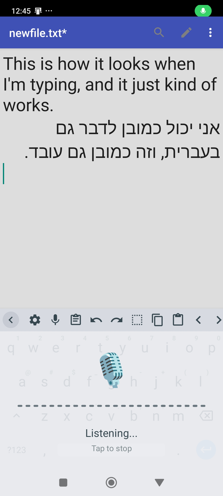
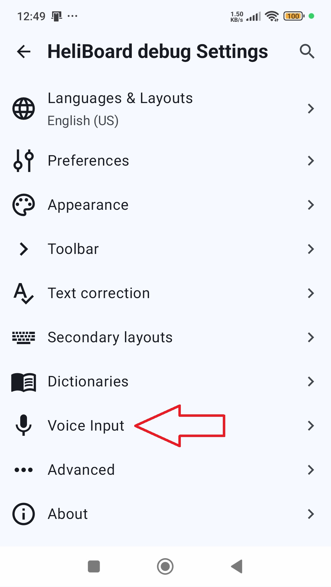
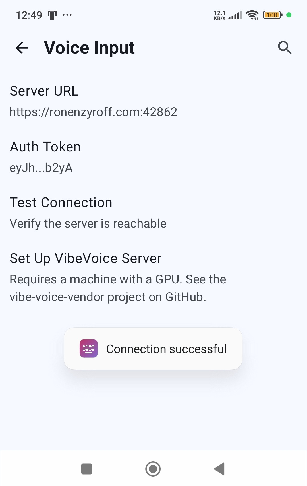

# HeliBoard + VibeVoice ASR

> **Disclaimer:** This project is not affiliated with, endorsed by, or sponsored by Microsoft Corporation. VibeVoice is a Microsoft product; this project merely integrates with it as an end user.

> **Note:** This is a fork of [HeliBoard](https://github.com/Helium314/HeliBoard). See the [original HeliBoard README](README-orig.md) for upstream documentation.

---

Voice typing on Android is terrible. It's nowhere near state-of-the-art, and typing on a phone all day genuinely hurts — thumbs, wrists, everything. It shouldn't have to be this way.

This project replaces HeliBoard's voice input with [VibeVoice](https://huggingface.co/microsoft/VibeVoice), Microsoft's state-of-the-art ASR model. You speak, it transcribes — in any language, with real accuracy.

The core promise: **you can speak into this keyboard for as long as you want and trust that your recording is safe on disk** — even if the network fails, the server is down, the application is killed, or the phone's audio system misbehaves. Every recording is saved as a WAV file before transcription begins. If transcription fails, the recording is kept so you can retry later. You never lose what you said.



## How it works

The voice typing is powered by [vibe-voice-vendor](https://github.com/NatanFreeman/vibe-voice-vendor), a self-hosted VibeVoice server by [@NatanFreeman](https://github.com/NatanFreeman). The keyboard records audio on your Android smartphone, sends it to your server, and streams back the transcription.

1. Tap the mic icon in the keyboard toolbar — a landing menu appears
2. Tap **New Recording** and speak — audio is captured as a 16 kHz mono WAV file and saved to disk immediately
3. Tap anywhere to stop recording
4. The audio is uploaded to your VibeVoice server over HTTPS with Bearer token authentication
5. The server streams back the transcription via Server-Sent Events
6. The transcribed text is automatically typed into whatever text field you're using

If transcription fails, the keyboard retries up to 3 times. If all retries fail, the recording stays on disk — tap **Recordings** from the landing menu to browse, re-transcribe, copy, or delete past recordings. Up to 50 recordings are kept.

If the keyboard is dismissed while recording or transcribing, the work continues in the background. When the keyboard reappears, the overlay reattaches.

## The catch

You need to run your own [vibe-voice-vendor](https://github.com/NatanFreeman/vibe-voice-vendor) server on a machine with a decent GPU (tested on NVIDIA GeForce RTX 5090). The server runs the VibeVoice model via vLLM and exposes a simple HTTP API.

Once your server is up, configure it in the app:



Enter your server URL and auth token in **Settings > Voice Input**, then tap **Test Connection** to verify:



## Building from source

Run the included [`build.sh`](build.sh) script from the repository root:

```bash
VIBEVOICE_VERSION="0.5.1" ./build.sh
```

It validates all prerequisites (JDK 17, Android SDK, NDK, etc.) and produces a debug APK at `app/build/outputs/apk/debug/`.

## Installing

Download the latest APK from the [Releases](https://github.com/BigBIueWhale/heliboard-microsoft-vibevoice-asr/releases) page, or [build it from source](#building-from-source), then:

1. Transfer the APK to your Android smartphone and install it (enable "Install from unknown sources" if prompted)
2. Go to **Settings > System > Languages & input > On-screen keyboard** and enable **HeliBoard VibeVoice Debug**
3. Open any text field, switch to HeliBoard VibeVoice via the keyboard icon in the navigation bar
4. Open **HeliBoard VibeVoice Settings > Voice Input** and enter your server URL and auth token
5. Tap the mic icon in the toolbar — grant the microphone permission on first use

> **Note:** The APK is a debug build (signed with a debug key, app ID `helium314.keyboard.vibevoice.debug`). Minification is enabled so the APK size stays small. There is no release signing keystore configured.

## App compatibility

### RustDesk remote desktop

Voice typing and clipboard paste work when typing into a remote machine via [RustDesk](https://github.com/rustdesk/rustdesk) on Android. Text is inserted character by character so that RustDesk's Flutter-based text field (which detects input by diffing its value on each change callback) sees each character as a separate keystroke — the same as normal typing. This applies to both voice transcription and the keyboard's paste action.

### Google Gemini and other WebView-based editors

Voice-typed text is fully committed (not left in Android's composing/underline state) so that WebView-based applications like the Google Gemini Android application do not discard the last portion of text when the user presses Send.

## Fork details

### Upstream source

- **Repository:** https://github.com/Helium314/HeliBoard
- **Tag:** `v3.5`
- **Commit:** [`d8a5842`](https://github.com/Helium314/HeliBoard/commit/d8a5842b7379083f0681484f11b6484919a77eaa)

### Files added

All paths relative to `app/src/main/`:

| File | Description |
|---|---|
| `java/.../voice/AudioRecorder.kt` | Records microphone audio to a WAV file (16 kHz, mono, 16-bit PCM). Reports RMS amplitude for the UI visualization. Releases the microphone in a `finally` block so it is never leaked. |
| `java/.../voice/VibeVoiceClient.kt` | HTTP client for the VibeVoice server. Multipart WAV upload, Server-Sent Events streaming response, JWT Bearer token authentication. Handles self-signed TLS certificates. |
| `java/.../voice/VoiceInputController.kt` | Orchestrates the full voice input lifecycle: recording, transcription with retry, overlay UI (landing menu, amplitude bars, recordings list, status text). Theme-aware. |
| `java/.../voice/RecordingStore.kt` | File-based storage for WAV recordings and their transcriptions. Filesystem is the source of truth — marker files track transcription state. Cleans up stale state on startup. |
| `java/.../voice/VoicePermissionActivity.kt` | Transparent activity to request `RECORD_AUDIO` permission (required because `InputMethodService` cannot show permission dialogs directly). |
| `java/.../settings/screens/VoiceInputScreen.kt` | Settings screen for server URL, auth token, test connection, and setup link. |
| `java/.../settings/screens/SavedRecordingsScreen.kt` | Full management screen for saved recordings — transcribe, copy, delete individual or all recordings. |
| `res/drawable/ic_settings_voice.xml` | Mic icon for the Voice Input settings entry. |
| `res/xml/network_security_config.xml` | Android network security configuration (self-signed TLS handled programmatically). |

### Files modified

All paths relative to `app/src/main/`:

| File | Changes |
|---|---|
| `AndroidManifest.xml` | Added `RECORD_AUDIO` and `INTERNET` permissions, network security configuration, `VoicePermissionActivity` registration. |
| `java/.../latin/LatinIME.java` | Replaced `switchToShortcutIme` with `VoiceInputController` integration. Handles start/stop/cancel lifecycle. Voice text insertion uses character-by-character `commitText` outside any batch edit (for RustDesk compatibility) with explicit `finishComposingText` after insertion (for WebView editor compatibility). |
| `java/.../latin/inputlogic/InputLogic.java` | Clipboard paste (`onTextInput`) inserts text character by character for RustDesk compatibility. |
| `java/.../latin/InputAttributes.java` | Removed conditions that hid the mic key when no system voice IME was installed. Voice key now shows on all non-password fields. |
| `java/.../latin/settings/Settings.java` | Added `PREF_VIBEVOICE_SERVER_URL` and `PREF_VIBEVOICE_AUTH_TOKEN` preference keys. |
| `java/.../latin/settings/Defaults.kt` | Added empty-string defaults for VibeVoice preferences. |
| `java/.../settings/SettingsContainer.kt` | Registered Voice Input settings factory. |
| `java/.../settings/SettingsNavHost.kt` | Added `VoiceInput` navigation route. |
| `java/.../settings/screens/MainSettingsScreen.kt` | Added Voice Input entry to the main settings menu. |

---

## Release notes

### vibevoice-v0.5.1

- **Fix: voice typing into RustDesk remote sessions stopped working in v0.5.0.** v0.5.0 incorrectly wrapped the character insertion loop in a batch edit, which collapsed all per-character change notifications into one. RustDesk needs to see each character arrive individually. Reverted to the original unbatched loop.

- **Fix: the Google Gemini Android application (and other WebView-based editors) dropped the last portion of voice-typed text on Send.** After inserting voice text, the keyboard marked the last word as "composing" (Android's underlined in-progress state) to offer autocorrect suggestions. WebView-based editors discard composing text on submit. Voice-typed text is now fully committed. This is why typing one character after voice input used to "fix" it — the manual keystroke finalized the composing text.

### vibevoice-v0.5.0

Reliability overhaul. You should be able to speak into this keyboard for as long as you want, in any Android application, and trust that your recording is safe — even if the network fails, the application is killed, or the phone's audio system misbehaves.

#### Recording reliability

- **Fix: the Android smartphone's microphone could get permanently locked, producing 0-byte recordings until the phone was rebooted.** If anything went wrong during recording (storage full, SD card unmounted, audio hardware error), the microphone was never released. Every recording after that point would appear to start normally but capture no audio. The only recovery was restarting the phone. The microphone is now always released, regardless of what errors occur.

- **Fix: a race condition between stopping a recording and starting the next one could lock the microphone or corrupt the new recording.** The recording thread now holds its own private reference to the microphone, so the main thread cannot interfere with it. Previously, quickly stopping and restarting a recording could cause the new recording to be silently destroyed.

- **Fix: if the Android audio system started returning errors (for example, because another application seized the microphone), the keyboard would spin silently, draining the smartphone's battery and producing a 0-byte file.** The recording now aborts after 3 consecutive errors and tells the user "Recording too short" instead of spinning indefinitely with the "Listening..." UI showing.

- **Fix: empty recordings (0-byte files with no audio) were sent to the VibeVoice server for transcription, retried 3 times, and sometimes kept on disk — all with no feedback to the user.** Recordings shorter than about 1 second are now discarded immediately with a "Recording too short" message.

#### Storage

- **Fix: force-stopping the keyboard application (or an Android out-of-memory kill) during transcription permanently corrupted the recordings list.** Recordings would get stuck in "Transcribing..." status forever and could never be automatically cleaned up, eventually filling all recording slots with undeletable entries. Stale transcription markers are now cleaned up every time the keyboard starts.

- **Fix: the storage cap could get permanently stuck, unable to delete old recordings to make room for new ones.** The cap now always frees space, even in edge cases where previous cleanup attempts failed.

- **Fix: when deleting a recording failed (for example, because the file was locked), the keyboard silently pretended it succeeded.** Failed deletions are now reported to the user with a toast message, and the storage cap only counts deletions that actually worked.

- **Storage cap raised from 10 to 50 recordings.** A heavy voice-typing session could burn through 10 recordings in minutes. With 50 recordings and the scrollable recordings list fix (see below), all recordings are visible and manageable from the keyboard overlay.

- **Recording filenames now use millisecond precision** to prevent filename collisions when stopping and starting recordings rapidly. Recordings from older versions are automatically cleaned up on upgrade.

#### Text insertion

- **Fix: the keyboard's user interface disappeared (white screen) when inserting text from the recordings list.** Some Android applications react to rapid text insertion by requesting a new input session, which tore down the keyboard mid-insertion. The keyboard overlay is now removed before text insertion begins so this teardown is harmless.

#### Other

- **Flat 500ms retry delay instead of exponential backoff.** When the self-hosted VibeVoice server is briefly unreachable, the worst-case retry time is now 1.5 seconds instead of 14 seconds.
- **The recordings list no longer grows beyond the keyboard height.** Previously, with enough recordings, the list would expand the keyboard area to fill the entire smartphone screen. It now scrolls within the normal keyboard area.
- **Cancellation is now guaranteed to take effect immediately.** Previously, pressing "Cancel" on the transcription overlay could be ignored due to a thread visibility issue, leaving the upload running in the background.
- **All silent failures now show a message.** "No speech detected," "Recording too short," "Failed to delete recording," "Warning: transcription not saved to disk" — the keyboard no longer silently swallows errors.

### vibevoice-v0.4.1

- **Fix: text insertion not working.** Transcription results were not being typed into the text field. The overlay was kept visible after auto-insert, which interfered with text commitment.
- **Fix: transcription text not saved to disk.** The file save method silently failed on Android external storage. Replaced with a method that works reliably.

### vibevoice-v0.4.0

Redesigned voice input UX around a state-driven overlay with a landing menu, persistent recordings, and full cancellability.

- **Landing menu.** Tapping the mic icon opens a landing screen with "New Recording" and "Recordings" options instead of immediately starting recording.
- **Auto-insert.** Transcription results are automatically typed into the text field when complete. No extra tap required.
- **Recordings are never lost.** Voice recordings are saved to user-accessible storage (`Android/data/<app>/files/vibevoice_recordings/`), browsable in any file manager.
- **Recordings list in the overlay.** Browse, re-transcribe, re-insert, copy, or delete past recordings directly from the keyboard overlay.
- **Automatic retry.** Transcription retries up to 3 times on network failure.
- **Background transcription survives keyboard close.** If the keyboard hides during recording or transcription, work continues in the background. The overlay reattaches when the keyboard reopens.
- **Instant cancellation.** Every state is cancellable. Cancelling during transcription immediately aborts the HTTP connection. The recording is always preserved on disk.
- **Saved Recordings in Settings.** Settings > Voice Input > Saved Recordings provides a full management screen.
- **Increased timeouts.** HTTP read timeout raised to 10 minutes to support long recordings.

### vibevoice-v0.3.0

Internal release (superseded by v0.4.0).

### vibevoice-v0.2.0

- Voice typing and clipboard paste now work in [RustDesk](https://github.com/rustdesk/rustdesk) remote sessions on Android smartphones.

### vibevoice-v0.1.0

Initial release. Fork of [HeliBoard v3.5](https://github.com/Helium314/HeliBoard/releases/tag/v3.5) with the stock voice input completely replaced by a custom VibeVoice ASR client.

- Voice typing via a self-hosted [vibe-voice-vendor](https://github.com/NatanFreeman/vibe-voice-vendor) server (Microsoft VibeVoice model)
- Records 16 kHz mono WAV audio on-device, uploads via HTTPS with Bearer token authentication
- Server streams back transcription via Server-Sent Events
- Recording overlay with live amplitude visualization, themed to match keyboard colors
- Settings screen for server URL, auth token (masked), and connection test
- Supports self-signed TLS certificates
- Multilingual — transcription language depends on the VibeVoice model, not the keyboard layout
- Debug APK build with minification enabled for small APK size
- Automated releases via GitHub Actions on `vibevoice-v*` tags
